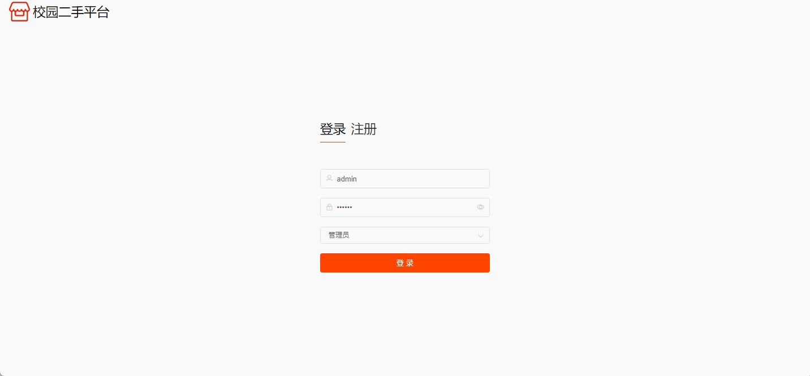

# secondhand🎂
基于SpringBoot+Vue二手交易平台

## 介绍🌞

> 构建一个基于Spring Boot和Vue的校园二手交易平台是一个很好的项目，旨在为学生提供一个方便的平台来买卖二手物品。这样的平台可以包括用户管理、商品发布、搜索、购买、评价等功能。

## 项目演示🌞

> 用户端


> 管理端



## 安装教程🌞

```
1. 运行环境准备mysql8 + java8 + node14.16.1

2. 配置maven路径，加载依赖

3. 运行sql文件，确保application.yml或config.properties的数据库名称和账号密码是数据库所在主机的账号密码
```


## 使用说明🌞

```
1. 登入
	
	管理端账号：admin 密码：123456
	
	用户账号：user 密码：123456
  
2. 运行流程

SpringBoot+Vue项目的部署详情可以查看这篇CSDN博客：http://t.csdnimg.cn/kpuxS

前后端不分离项目的部署流程可以查看这篇CSDN博客：http://t.csdnimg.cn/CslA5
```


## CSDN项目合集🌞

点击前往：http://t.csdnimg.cn/Q4u84


## 联系我🌞

**有偿获取完整源码或调试代码**

🐧：1902317191

微信：


